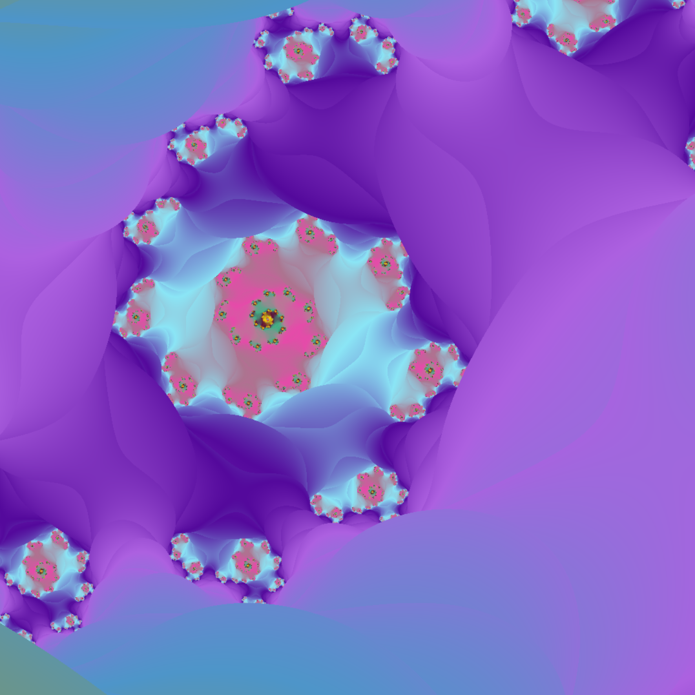

# Fractal Visualizer in C

A multi-threaded fractal visualizer with 4 different fractals and many ways to view them.


## Usage
```sh
git clone --recurse-submodules https://github.com/Epicurius/Fract-ol.git && cd fract-ol && make
./fractol
```


## Features:

- Multithreaded
- Zooming in with mouse scroll
- Moving towards mouse when zooming
- Panning with arrows
- Mouse movement controls for both Julia fractals
- Randomized color palets.
- Adjustable color palette size
- Smooth colors
- Adjustable max iteration limit
- Adjustable iterations.
- Help menu 'H'


### Headers
Edit following macros in the `fractol.h` file.
`HEIGHT % THREADS` should be `0.`
```
# define WIDTH 1920
# define HEIGHT 1080
# define THREADS 8
# define MAX_ITER 50
# define COLORS 6
```


## Constraints
This project was made as part of the graphics branch in Hive Helsinki.
Therefore the code follows 42's strict norms:
- Functions must not exceed 25 lines
- Max 5 functions in a .c file
- Cannot stick variable declaration and initialization on the same line
- Max 5 variables per block
- Max 4 parameters per function
- Forbidden keywords: `for`,  `do ... while`, `switch`, `case`, `goto`

